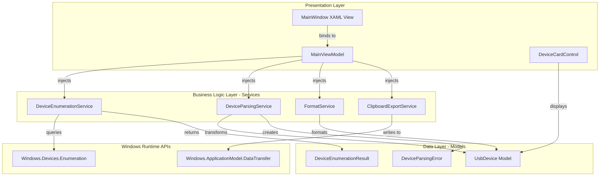
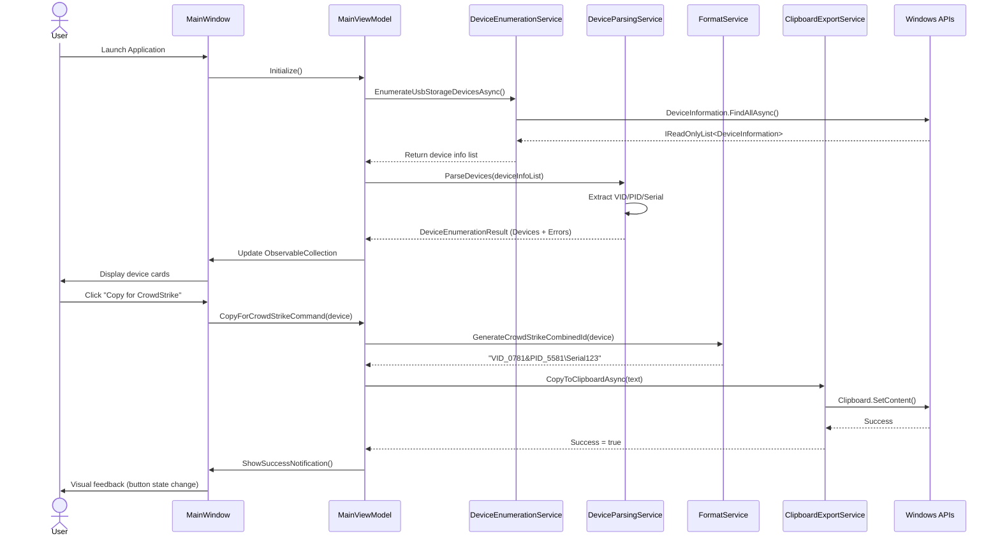

# Components

## DeviceEnumerationService

**Responsibility:** Discovers connected USB storage devices using Windows.Devices.Enumeration API and returns raw DeviceInformation objects for parsing.

**Key Interfaces:**
- `Task<IReadOnlyList<DeviceInformation>> EnumerateUsbStorageDevicesAsync()` - Asynchronously queries Windows API for PortableStorageDevice class, returns collection of DeviceInformation objects
- `string GetDeviceSelector()` - Returns AQS (Advanced Query Syntax) filter string to exclude internal SD card readers and non-USB devices

**Dependencies:** `Windows.Devices.Enumeration.DeviceInformation` (Windows Runtime API) - Direct dependency on Windows API for device discovery

**Technology Stack:** Uses `DeviceInformation.FindAllAsync()` with `DeviceClass.PortableStorageDevice` selector, all methods async/await pattern, implements retry logic for transient enumeration failures (3 attempts with 500ms backoff)

## DeviceParsingService

**Responsibility:** Parses raw DeviceInformation objects to extract VID, PID, Serial Number from Device Instance Path and HardwareIds arrays, returning UsbDevice models.

**Key Interfaces:**
- `DeviceEnumerationResult ParseDevices(IReadOnlyList<DeviceInformation> deviceInfoList)` - Transforms DeviceInformation objects into UsbDevice models, capturing parsing errors
- `UsbDevice? TryParseDevice(DeviceInformation deviceInfo, out DeviceParsingError? error)` - Attempts to parse single device, returns null and error if parsing fails
- `(string VendorId, string ProductId)? ExtractVidPid(string deviceInstancePath)` - Regex-based extraction from Device Instance Path pattern `USB\VID_xxxx&PID_xxxx\...`
- `string? ExtractSerialNumber(string deviceInstancePath)` - Extracts serial number from Device Instance Path suffix

**Dependencies:** No service dependencies (pure parsing logic)

**Technology Stack:** Uses `System.Text.RegularExpressions.Regex` for Device Instance Path parsing with pattern `USB\\VID_([0-9A-F]{4})&PID_([0-9A-F]{4})\\(.+)`, compiled regex with `RegexOptions.Compiled` for performance (NFR1: <3 seconds enumeration)

## FormatService

**Responsibility:** Generates formatted output strings for CrowdStrike and helpdesk export from UsbDevice models.

**Key Interfaces:**
- `string GenerateCrowdStrikeCombinedId(UsbDevice device)` - Returns format: `VID_0781&PID_5581\4C530001231120115142`
- `string GenerateCrowdStrikeManualEntry(UsbDevice device)` - Returns multi-line format with separate VID, PID, Serial fields
- `string GenerateHelpdeskFormat(UsbDevice device)` - Returns human-readable format with device name, manufacturer, identifiers
- `string GenerateBulkExport(IEnumerable<UsbDevice> devices, ExportFormat format)` - Batch export multiple devices in specified format

**Dependencies:** No service dependencies (pure formatting logic)

**Technology Stack:** Uses string interpolation and `StringBuilder` for multi-line formats, template strings defined as constants for consistency

## ClipboardExportService

**Responsibility:** Copies formatted device data to Windows clipboard using WinRT DataTransfer API.

**Key Interfaces:**
- `Task CopyToClipboardAsync(string text)` - Writes plain text to Windows clipboard
- `Task<bool> TrySetClipboardDataAsync(string text)` - Safe wrapper with error handling, returns success status
- `void ShowClipboardSuccessNotification()` - Triggers UI notification for copy confirmation (delegates to event or callback)

**Dependencies:** `Windows.ApplicationModel.DataTransfer.Clipboard` (Windows Runtime API) - Direct dependency on Windows clipboard API

**Technology Stack:** Uses `DataPackage.SetText()` and `Clipboard.SetContent()` from WinRT, all methods async since clipboard operations can be slow on enterprise systems with clipboard monitors, implements error handling for clipboard access failures

## Component Diagrams

**Sequence Diagram: Device Enumeration and Copy Workflow**

