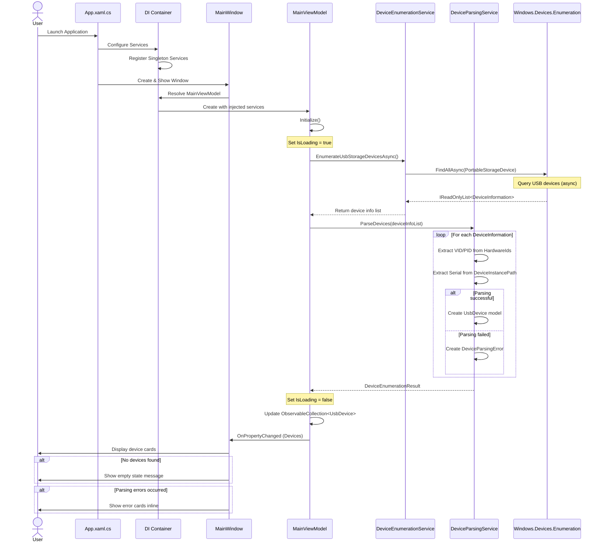
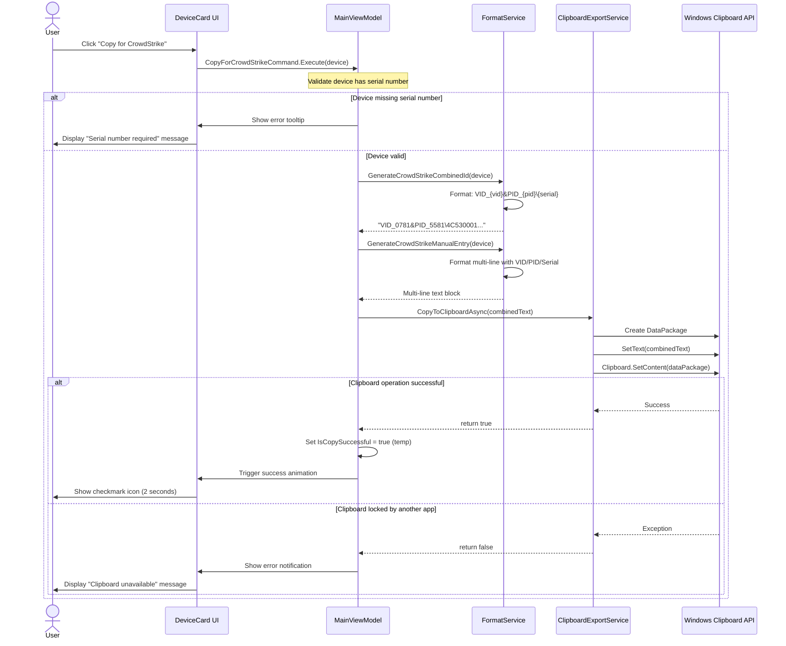
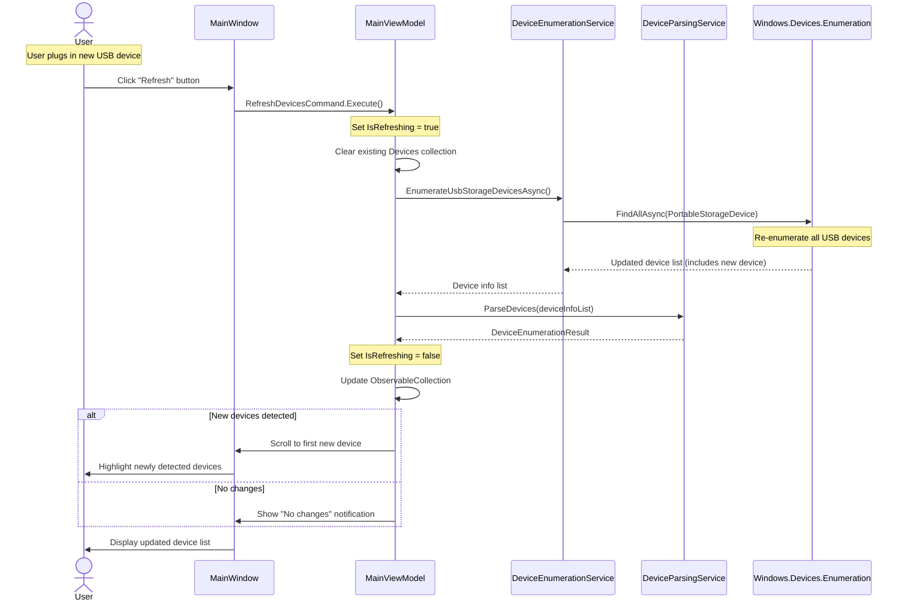
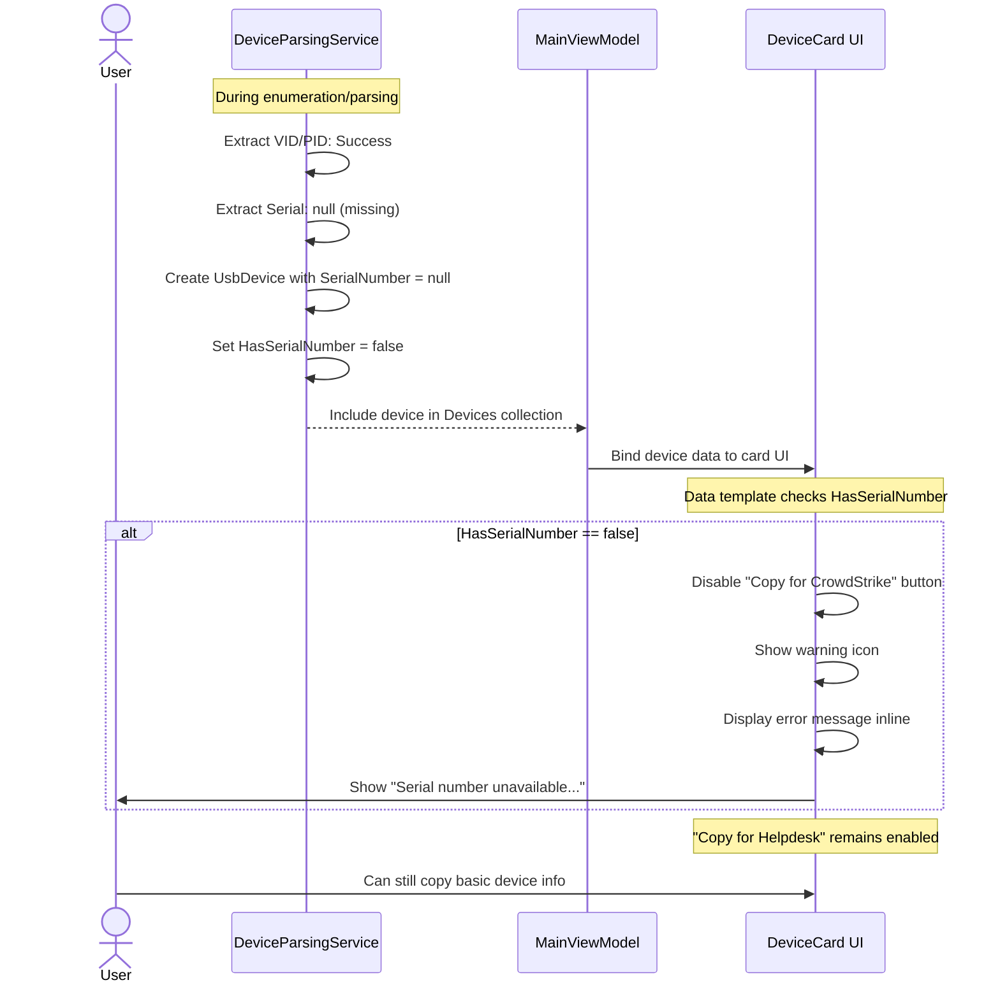

# Core Workflows

## Workflow 1: Application Launch and Initial Device Enumeration

## Workflow 2: Copy for CrowdStrike Export

## Workflow 3: Manual Refresh with New Device Detection

## Workflow 4: Error Handling - Device Without Serial Number

