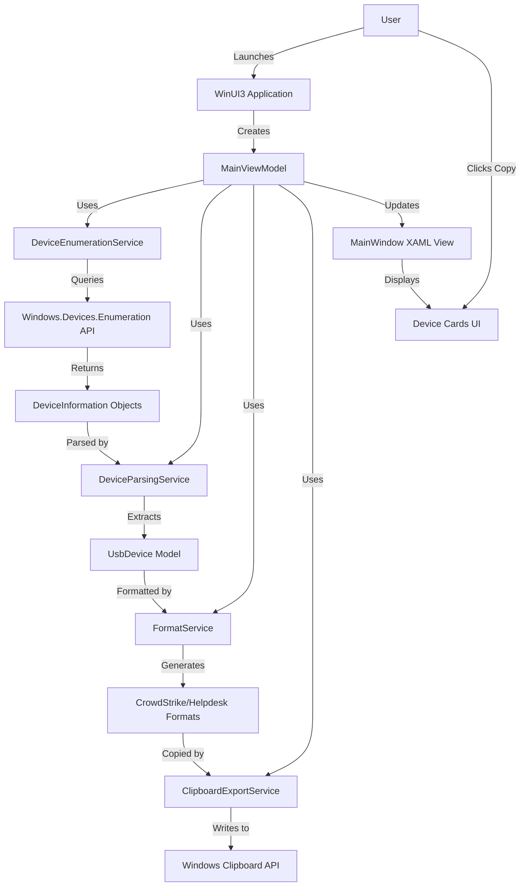

# High Level Architecture

## Technical Summary

The USB Device Inspector employs a **monolithic desktop application architecture** with a three-layer design pattern: Presentation (WinUI3 Views/ViewModels), Business Logic (Service Layer), and Data Access (Windows Runtime API wrappers). The system follows the **MVVM (Model-View-ViewModel) pattern** mandated by WinUI3, using **CommunityToolkit.Mvvm** for observable properties and commands.

Core technology choices center on **.NET 8.0 with C# 12** and **WinUI3 (Windows App SDK 1.5+)** for native Windows integration. The architecture prioritizes **Standard-User compatibility** by exclusively using `Windows.Devices.Enumeration` APIs that don't require elevation. All device enumeration operations execute **asynchronously** to maintain UI responsiveness, with in-memory data models eliminating any persistence layer.

The architecture directly supports PRD goals by: (1) enabling sub-60-second workflows through clipboard-ready formatted output, (2) providing zero-configuration operation via automatic device enumeration on launch, and (3) ensuring broad enterprise deployment through Standard-User account compatibility and offline-only operation.

## High Level Overview

**Architectural Style:** **Monolithic Desktop Application** with service-oriented internal architecture

**Repository Structure:** Monorepo containing the WinUI3 application (`src/UsbDeviceInspector/`), unit tests (`src/UsbDeviceInspector.Tests/`), and documentation (`docs/`)

**Service Architecture:** Single-process application with layered service design:
- **Presentation Layer:** WinUI3 XAML Views + ViewModels (MVVM)
- **Business Logic Layer:** Service classes (`DeviceEnumerationService`, `DeviceParsingService`, `ClipboardExportService`, `FormatService`)
- **Data Access Layer:** Windows Runtime API wrappers (`Windows.Devices.Enumeration`, `Windows.ApplicationModel.DataTransfer`)

**Primary User Interaction Flow:**
1. User launches application → Automatic device enumeration begins
2. System queries `Windows.Devices.Enumeration` API for `PortableStorageDevice` class
3. Device properties parsed to extract VID, PID, Serial Number from Device Instance Path
4. Results displayed as cards in scrollable list
5. User clicks "Copy for CrowdStrike" or "Copy for Helpdesk" → Formatted text copied to clipboard
6. User can manually refresh to detect newly connected devices

**Key Architectural Decisions:**

1. **No Elevation Required:** Exclusive use of `Windows.Devices.Enumeration` API ensures Standard-User compatibility, avoiding WMI or registry APIs that require admin privileges

2. **In-Memory Only:** No database, no file persistence, no configuration files. All data lives in-memory during application runtime, reducing security surface and complexity

3. **Async-First Design:** All I/O operations (device enumeration, clipboard) use async/await to prevent UI blocking per NFR2 (UI responsiveness)

4. **Service Layer Pattern:** Business logic encapsulated in testable service classes, enabling 80%+ unit test coverage without UI automation

5. **Offline-Only Operation:** Zero network calls, zero telemetry, zero external dependencies beyond Windows APIs and clipboard

## High Level Project Diagram

## Architectural and Design Patterns

- **MVVM (Model-View-ViewModel):** Separates UI (XAML Views) from presentation logic (ViewModels) and business logic (Services). ViewModels use `ObservableObject` base class from CommunityToolkit.Mvvm for property change notifications. - _Rationale:_ Required pattern for WinUI3 data binding, enables unit testing of logic without UI dependencies, aligns with PRD requirement for card-based reactive UI.

- **Service Layer Pattern:** Business logic encapsulated in single-responsibility service classes (`DeviceEnumerationService`, `DeviceParsingService`, etc.) injected into ViewModels via dependency injection. - _Rationale:_ Enables testability (80%+ coverage target), provides clear separation of concerns, allows future extension (e.g., adding WMI fallback service) without ViewModel changes.

- **Repository Pattern (Deferred to Phase 2):** Not implemented in MVP since there's no persistence layer. If future versions add local caching or settings storage, a repository abstraction would be introduced. - _Rationale:_ YAGNI principle - avoid over-engineering for hypothetical requirements.

- **Async/Await Throughout:** All I/O operations (device enumeration, clipboard) use Task-based asynchronous pattern (TAP). - _Rationale:_ Maintains UI responsiveness per NFR2 (3-second enumeration without blocking), leverages C# language features for clean async code.

- **Dependency Injection (Constructor Injection):** Services registered in `App.xaml.cs` using `Microsoft.Extensions.DependencyInjection`, injected into ViewModels via constructor parameters. - _Rationale:_ Enables unit testing with mock services, provides single point of configuration, aligns with .NET ecosystem best practices.

- **Factory Pattern (FormatService):** Centralized formatting logic generates multiple output formats (CrowdStrike Combined ID, Manual Entry, Helpdesk) from single `UsbDevice` model. - _Rationale:_ Eliminates duplication, ensures format consistency, simplifies adding new export formats (e.g., Intune, Jamf).
